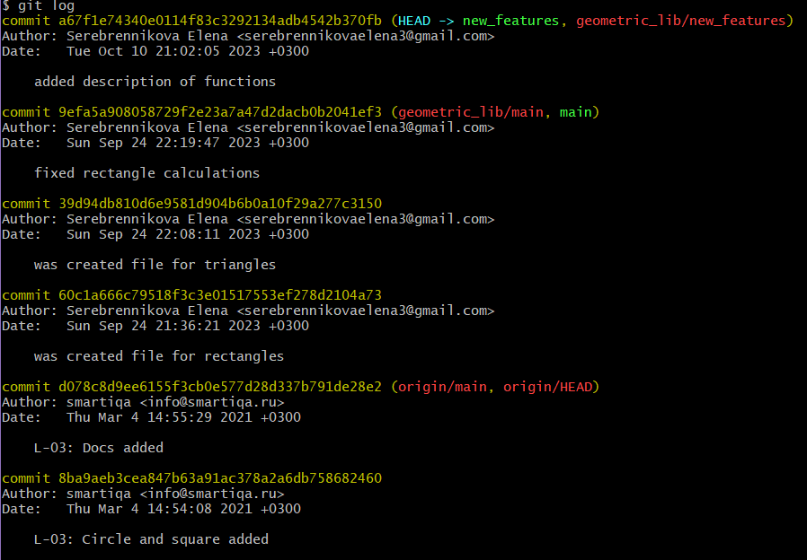

# Documentation
Geometric_lib project

---------
### General description

Librabry of functions calculating areas and perimeters of figures.

<br/><br/>

### Functions

#### *Circle.py*

- area(r)
  ```
  Принимает радиус круга r и возвращает площадь круга
  Пример вызова функции: 
    area(5)
    >> 78.53981633974483
  ```
- perimeter(r)
  ```
  Принимает радиус круга r и возвращает периметр круга
  Пример вызова функции: 
    area(5)
    >> 31.41592653589793
    ```

#### _Rectangle.py_

- area(a, b)
  ```
  Принимает стороны прямоугольника a, b и возвращает площадь прямоугольника.
  Пример вызова функции: 
    area(б, 7)
    >> 42 
    ```
- perimeter(a, b)
  ```
  Принимает стороны прямоугольника a, b и возвращает периметр прямоугольника.
  Пример вызова функции: 
    perimeter(б, 7)
    >> 26 
    ```

#### _Square.py_

- area(a)
  ```
  Принимает сторону квадрата a и возвращает площадь квадрата.
  Пример вызова функции: 
    a(3)
    >> 9 
    ```
- perimeter(a)
  ```
  Принимает сторону квадрата a и возвращает периметр квадрата.
  Пример вызова функции: 
    perimeter(8)
    >> 32 
    ```

#### _Triangle.py_

- area(a, b, c)
  ```
  Принимает сторону треугольника a, высоту треугольника h и возвращает площадь треугольника.
  Пример вызова функции: 
    area(4, 9)
    >> 36 
    ```
- perimeter(a, b, c)
  ```
  Принимает стороны треугольника a, b, c и возвращает периметр треугольника.
  Пример вызова функции: 
    perimeter(1, 6, 2)
    >> 9 
    ```
  
### Tests

CircleTestCase:<br/>
&emsp;test_default_area();<br/>
&emsp;test_area_zero_radius();<br/>
&emsp;test_area_negative_value();<br/>
&emsp;test_default_perimeter();<br/>
&emsp;test_zero_perimeter();<br/>
&emsp;test_perimeter_negative_value

RectangleTestCase:<br/>
&emsp;test_default_area<br/>
&emsp;test_area_zero_area();<br/>
&emsp;test_area_negative_value();<br/>
&emsp;test_default_perimeter();<br/>
&emsp;test_zero_perimeter;<br/>
&emsp;test_perimeter_negative_value();

SquareTestCase:<br/>
&emsp;test_default_area<br/>
&emsp;test_area_zero_area();<br/>
&emsp;test_area_negative_value();<br/>
&emsp;test_default_perimeter();<br/>
&emsp;test_zero_perimeter;<br/>
&emsp;test_perimeter_negative_value();

TriangleTestCase:<br/>
&emsp;test_default_area<br/>
&emsp;test_area_zero_area();<br/>
&emsp;test_area_negative_value();<br/>
&emsp;test_default_perimeter();<br/>
&emsp;test_zero_perimeter;<br/>
&emsp;test_perimeter_negative_value();


-----
### Commit history

